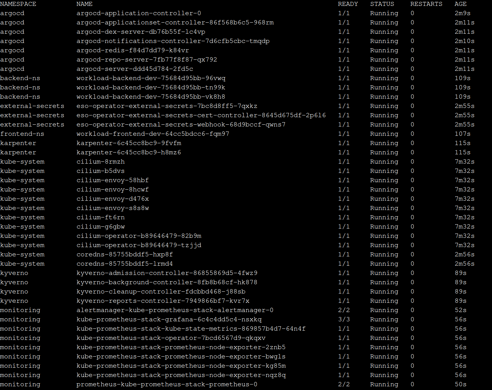

  <h1>Multi-Cloud Kubernetes Platform</h1>
  
Portfolio project demonstrating production-oriented Kubernetes platform engineering on AWS and Azure

## 👁️ Overview
I built a **multi-cloud Kubernetes platform across AWS and Azure** to explore how a production-oriented platform can be automated, secured and operated across two cloud providers.

It brings together **Terraform, Kubernetes, Cilium, Argo CD, GitHub Actions, Karpenter, Kyverno and Prometheus/Grafana** into one platform.

The project is intentionally built as a **learning and portfolio environment**, rather than a production system serving real users.

> 🚧 **Work in progress**. The core AWS and Azure infrastructure is implemented and both ingress paths have been validated end-to-end.
The final multi-cloud interconnect, cross-cloud security/observability model and architecture documentation are still in progress.

---

## 🛠️ Tech Stack
* **AWS Cloud:** VPC · EKS · ECR · CloudFront · Network Load Balancer · Secrets Manager · IAM/IRSA
* **Azure Cloud:** AKS · Container Registry · Front Door · Key Vault · Traffic Manager
* **Platform:** Kubernetes · Cilium · Gateway API · Karpenter · Helm
* **Infrastructure & Delivery:** Terraform · GitHub Actions · ArgoCD · Docker
* **Security:** Kyverno · Trivy · External Secrets Operator · IAM · NetworkPolicies · Cilium L3-L7 policies · Pod Security Standards
* **Observability:** Prometheus · Grafana · Node Exporter
* **Application:** Python · Django · React

---

## 🏗️ Architecture

Infrastructure is provisioned using **Terraform**, covering networking, compute, Kubernetes clusters, security, ingress, scaling and supporting services.

Current infrastructure footprint:

* **110+ AWS resources**
* **55+ Azure resources**

**Terraform state** is stored remotely in Amazon S3 with AES-256 encryption.

The current AWS infrastructure uses a state scoped to `eu-central-1`.

### Architecture & Design Decisions

The project includes several architecture decisions made during implementation and validated through research, testing and iteration.

These decisions cover topics such as:

- Terraform execution and private AKS access
- Argo CD bootstrap strategy
- Cilium networking and routing
- Multi-cloud secrets management
- Azure ingress architecture

> **📖 Detailed decisions and alternatives considered:**
> **[Architecture & Design Decisions →](./docs/architecture_decisions.md)**

---

## 🔄 CI/CD
The application delivery model follows a **CI + GitOps** approach.
- **Frontend:** - GitHub ➔ GitHub Actions ➔ build & test ➔ Docker image ➔ AWS/Azure registry ➔ Helm version/tag update ➔ ArgoCD ➔ EKS 
- **Backend:** - GitHub ➔ GitHub Actions ➔ build & test ➔ Docker image ➔ AWS/Azure registry ➔ Helm version/tag update ➔ ArgoCD ➔ EKS
- **ArgoCD (~10 apps):** - Kyverno, Karpenter *(AWS only)*, ESO, Gateway, Monitoring, Backend, Frontend
- **Rollback:** - Deployment ➔ ⛔Unhealthy Pod ✅ Healthy replicas ➔ Git revert ➔ ArgoCD reconciliation ➔ Previous version restored

---

## ⛔ Problems & 🛠️ Troubleshooting
One of the main goals of the project was to document the **engineering process behind failures**, not only the final configuration.

**Selected challenges:**

- **Cilium networking:** incorrect `egressMasqueradeInterfaces` configuration
  caused connectivity issues due to interface naming differences between EC2 instance types.

- **AWS VPC Endpoint + Cilium networking:** IRSA requests to AWS STS timed out because Pod traffic was blocked by the VPC Endpoint Security Group.

- **Gateway API:** Cilium initially failed to manage the GatewayClass because
  of an incompatible Gateway API CRD version.

- **Cilium IPAM:** migrating from AWS ENI-based IPAM to Cluster Pool IPAM
  required adjusting Kubernetes Pod capacity and node configuration.

- **Karpenter:** dynamically provisioned nodes initially failed to register
  because of an incompatible AMI/user-data configuration.

- **Node stability:** stress testing exposed resource constraints on `t3.small` nodes, including Cilium endpoint creation throttling and kubelet becoming unresponsive.

- **Argo CD / cross-node communication:** switching Cilium from native routing to VXLAN tunneling resolved Pod-to-Pod communication across nodes.

- **Github Actions OIDC:** GitHub Actions Could not assume role with OIDC. After renaming repo - token sub format changed to unusual format.

> **📖 Detailed investigation, diagnostics, root causes and fixes:
> **[Problems & Troubleshooting →](./docs/troubleshooting.md)****

---

## 💰 Cost Visibility

- **Cost allocation:** Terraform applies Project, Environment and ManagedBy tags for AWS cost tracking.
- **Karpenter:** dynamic node provisioning reduces idle capacity; Spot can be used for fault-tolerant workloads.
- **Cost monitoring:** AWS Cost Explorer with project/environment tags.
- **Trade-offs:** Karpenter uses smaller instances t3.small, while core nodes use bigger m7i-flex.large

---

  <h1>🚀 Infrastructure Roadmap</h1>

## 📍 Current Cluster Stage:
### AWS

### Azure
**[Current stage →](./docs/images/AKS_pods.md)**

---

## ✅ Progress Checklist

### ☁️ AWS
- [x] AWS VPC
- [x] S3 remote state
- [x] Amazon EKS
- [x] Multi-AZ networking
- [x] Cilium CNI
- [x] Cilium Cluster Pool IPAM
- [x] Cilium Gateway API
- [x] AWS Secrets Manager
- [x] ECR
- [x] CloudFront
- [x] TargetGroupBinding
- [x] Internal NLB
- [x] AWS Load Balancer Controller
- [x] AWS ingress path validated end-to-end

### 🔄 CI/CD & GitOps
- [x] GitHub Actions - build & test
- [x] Container image build
- [x] Push to AWS/Azure registry
- [x] Automated image tag update
- [x] ArgoCD
- [x] GitOps deployment
- [x] Deployment health monitoring via ArgoCD
- [x] Rollback strategy and recovery testing

### 🔐 Security
- [x] Kyverno
- [x] External Secrets Operator
- [x] IAM-based AWS access
- [x] Kubernetes PriorityClasses
- [x] Resource requests and limits
- [x] PodDisruptionBudgets
- [x] Cilium Network Policies (L3-L7, namespace isolation)
- [x] Pod Security Standards / restricted profile
- [x] Image scanning in CI (e.g. Trivy)
- [x] Kyverno policy expansion:
- [x] Disallow privileged containers
- [x] Enforce resource requests and limits
- [x] Require mandatory labels

### 📊 Observability
- [x] Prometheus
- [x] Grafana
- [x] Alertmanager
- [x] kube-state-metrics
- [x] Node Exporter
- [x] Kubernetes dashboards
- [x] Application-level metrics
- [x] Loki
- [ ] Centralized logging
- [ ] Full alerting workflow

### 💰 Cost Visibility
- [x] Cost allocation tags across resources
- [x] Karpenter cost-aware provisioning notes
- [x] Cost trade-offs documented in README

### 🧪 Reliability & Disaster Recovery
- [x] Karpenter
- [x] Karpenter scale-up testing
- [x] Karpenter scale-down testing
- [x] Pod failure testing
- [x] Node failure testing
- [x] Workload rescheduling
- [ ] Database backup and restore testing
- [ ] Disaster recovery runbook
- [ ] RTO definition
- [ ] RPO definition

### 📖 Documentation & Presentation
- [ ] Final architecture diagram
- [x] Design decisions and trade-offs
- [x] Known limitations documented
- [ ] Short deployment demo
- [ ] Final code cleanup

## 🌐 Phase 2 - Multi-Cloud Extension

The Azure environment is an explicit **learning and demonstration extension.**

The purpose is to explore what changes when the same platform concepts are introduced into a second cloud provider, and to make those trade-offs visible rather than hiding them behind a generic "multi-cloud" label.

### Azure
- [x] Azure AKS
- [x] Management/jumpbox
- [x] Cilium CNI
- [x] Azure networking
- [x] Azure Container Registry
- [x] Frontend CI
- [x] Frontend CD
- [x] Backend CI
- [x] Backend CD
- [x] Azure Front Door
- [x] Azure Traffic Manager
- [x] Azure ingress path validated end-to-end
- [ ] Azure monitoring

- [ ] Multi-Cloud interconnect
- [ ] Multi-Cloud security model
- [ ] Multi-Cloud reliability model
- [ ] PostgreSQL extension
- [ ] Redis/Valkey extension
- [ ] Database replication
